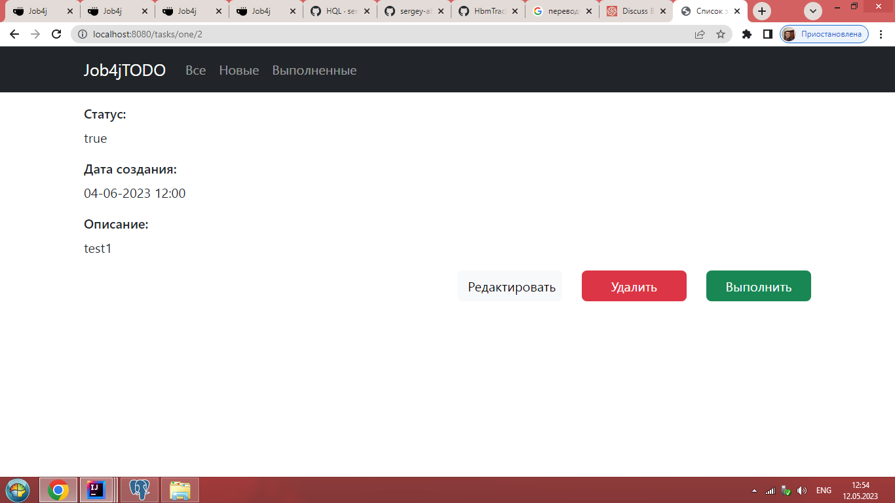
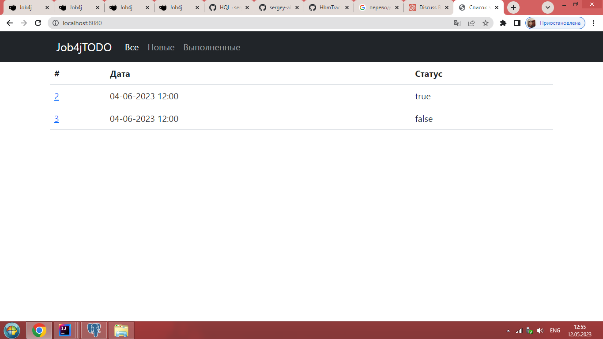
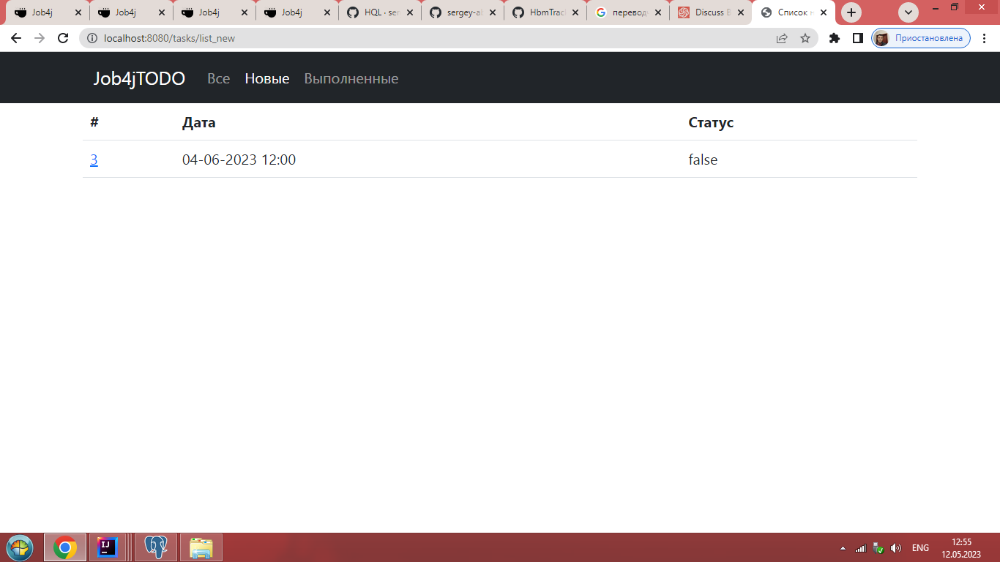
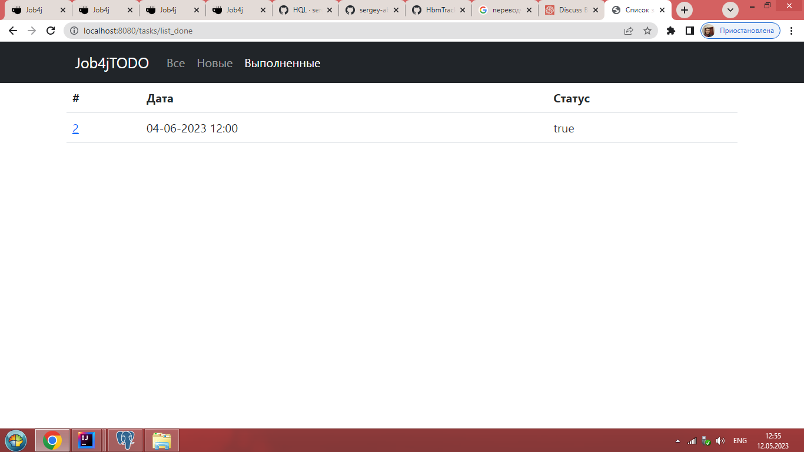

# job4j_todo

## О проекте

Проект представляет собой приложение TODO список. В приложении можно добавить заявку. Есть возможность 
редактирования заявки. Заявки имеют 2 статуса, выполнена и в работе.
____
Стек технологий: Spring boot, Thymeleaf, Bootstrap, Hibernate, PostgreSql.
_____
Скриншот страницы с описанием:

Скриншот страницы со списком всех задач:

Скриншот страницы со списком новых задач:

Скриншот страницы со списком выполненных:
